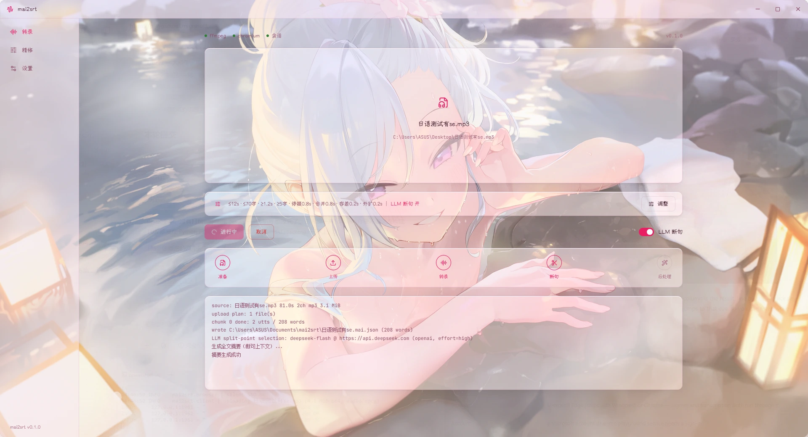
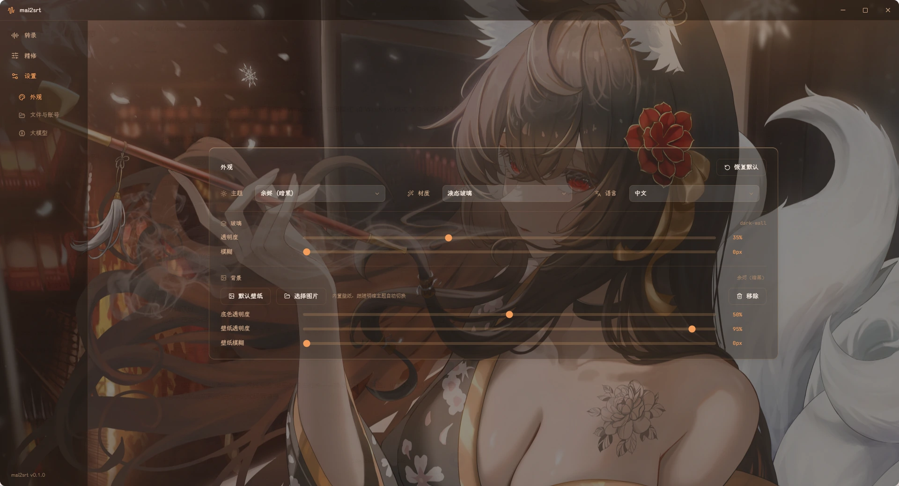
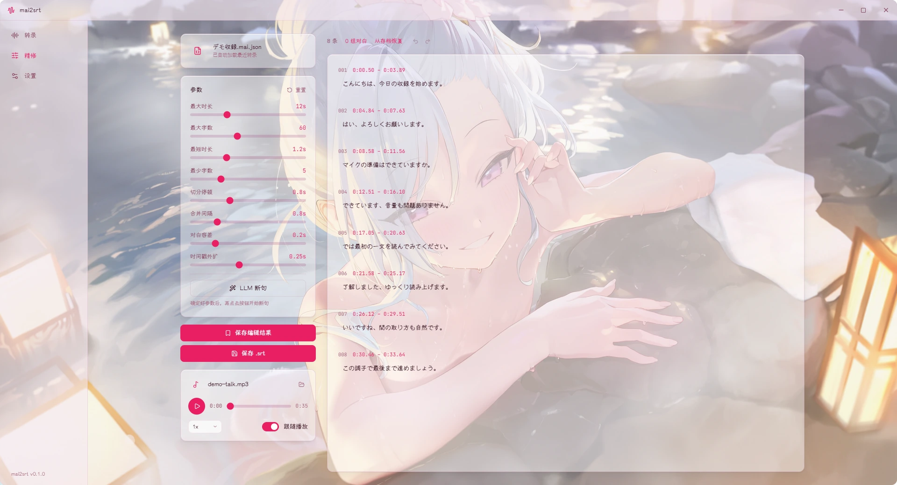
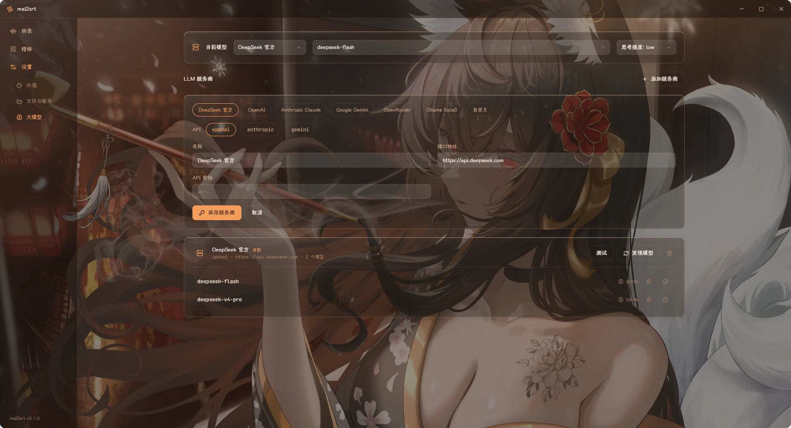

<div align="center">


# mai2srt

### A Windows desktop client for MAI-Transcribe-2

Drop in audio or video, get a word-level transcript, fix the segmentation the way you like it, export a standard SRT.

Free transcription · no GPU · Windows 10 / 11

<br />

[](./LICENSE) [](#requirements) [](https://www.python.org/downloads/) [](https://ffmpeg.org/) [](https://tauri.app/)

<br />

**[Download](../../releases/latest)** · [Usage](#usage) · [Build from source](#build-from-source) · [Command line](#command-line) · [简体中文](README.md)

<br />



<br />

**Transcribe page: drop in audio or video, press "transcribe and subtitle", and watch the progress, the chunks and the log as it runs.**

</div>

---

## What it solves

MAI-Transcribe-2 on [Microsoft AI Playground](https://playground.microsoft.ai/) is free, returns word-level timestamps and separates speakers — but it is a web page:

- one upload at a time, capped at 25 MiB / about 60 minutes, so anything longer has to be cut up by hand
- the service decides where the lines break, and you cannot change it

mai2srt fills those gaps: oversized files are compressed and split on silence, and the word timestamps are stitched back into one timeline. Segmentation can lean on an LLM or stay purely rule-based, the result is editable line by line, and the export is a standard SRT.

<table>
<tr>

<td width="25%" valign="top">

### Any audio or video

Common audio (mp3 / wav / m4a / flac / ogg / opus / aac / wma) and video (mp4 / mkv / webm / mov / avi and more) drop straight in.

Files over the site limit are compressed and split on silence, then stitched back.

</td>

<td width="25%" valign="top">

### Speaker separation

The speakers the transcription tells apart are kept. When several people talk too close together to separate, their words are folded into one multi-line subtitle — each line a short sentence starting with `- `.

</td>

<td width="25%" valign="top">

### Refine workspace

Edit the text line by line, split / merge / delete, listen to a single cue, click a line to jump to it, follow the playback highlight — with full undo and redo.

</td>

<td width="25%" valign="top">

### Optional LLM segmentation

Presets for DeepSeek / OpenAI / Claude / Gemini / OpenRouter / Ollama, or any compatible endpoint.

Subtitles come out fine with none of them configured.

</td>

</tr>
</table>

---

## How it works

```text
audio / video
     │
     │  over the site limits (25 MiB / ~60 min): compress + split on silence
     ▼
transcribe    playground MAI-Transcribe-2  →  word timestamps + speakers
     │
     ▼
segment       punctuation and pauses decide the breaks; an LLM only helps pick better ones
     │
     ▼
refine        edit text / split / merge / delete / listen / click a line to jump
     │
     ▼
export        <name>.srt      (refined export: <name>_refined.srt)
```

## Appearance

Two themes — rose (light) and ember (dark) — each with a **liquid glass** and a **frosted glass** material, plus custom wallpapers. The theme can follow the system or be pinned to light / dark.



---

## Refine page

This is where you rewrite the subtitles. The left column holds the segmentation parameters, and one click re-splits with the new ones; the right column is the result, line by line — click any text to edit it, split with the scissors, merge adjacent lines, delete leftovers, and click a line to send the player there so you can listen while you edit. Undo and redo cover the whole session; "save edits only" keeps the edit record with the project (it comes back next time, and edited lines carry a "manually edited" badge), and "save .srt" exports.



---

## Requirements

| Item | Requirement |
| --- | --- |
| OS | Windows 10 / 11 (64-bit) |
| Browser | Microsoft Edge (ships with Windows) or Chrome — both sign-in and transcription run through it |
| Account | a Microsoft account (the free playground service asks you to sign in) |
| Network | access to playground.microsoft.ai |

FFmpeg is bundled with the installer — you do **not** need to install it yourself.

---

## Install

1. Download the latest `mai2srt_x.y.z_x64-setup.exe` from [Releases](../../releases)
2. Run it. On a first install Windows SmartScreen may show its blue warning → click "More info" → "Run anyway"
3. It installs to your user folder by default (`C:\Users\<you>\AppData\Local\mai2srt`) — change it in the wizard if you like; mai2srt then appears in the Start menu

> [!NOTE]
> The first launch after installing takes a moment: the backend process starts for the first time, and an antivirus scan of the newly written files makes it slower — a "starting" card appears before the window does. Later launches are quick.

---

## Usage

1. After launching, go to **Settings → Files & Accounts → playground accounts**, type any name, and sign in with one of your Microsoft accounts. A browser window opens; sign in normally and the session is kept from then on
2. If you want an LLM to help with segmentation, go to **Settings → AI Model → add provider**, pick a provider and paste its API key, then set it as the current model. This is optional — without it, segmentation falls back to punctuation and pauses

    

3. On the **Transcribe** page, drop your audio or video file into the window (or click to browse), decide whether the "LLM split" toggle should be on, then press "transcribe and subtitle" and wait for it
4. When it finishes you get two files: the `.mai.json` transcript (word timestamps, stored in the project library `Documents\mai2srt`) and a `.srt` produced from the segmentation (written next to the source file)
5. To make the segmentation finer, click "refine subtitles" to open the Refine page and edit, merge, delete or split as needed. You can listen while you adjust, and clicking a line jumps to that cue
6. When you are happy, press "save .srt" — it writes `<name>_refined.srt` next to the original audio/video, leaving the earlier `.srt` untouched

If you drop a `.mai.json` instead of media, the button becomes "generate subtitles": transcription is skipped and only the segmentation runs again. That spends no transcription quota and is the right path for tuning.

| Shortcut | Action |
| --- | --- |
| Ctrl + Z / Ctrl + Shift + Z (or Ctrl + Y) | undo / redo |
| Ctrl + S | save edits only |
| Ctrl + Enter / Esc inside a text box | commit / cancel that edit |

The interface language can be switched in **Settings → Appearance**.

---

## Data locations and privacy

Sign-in sessions, project files and caches all stay on this machine:

| What | Where |
| --- | --- |
| sign-in session (cookies) | `~/.mai2srt/accounts/` |
| LLM endpoint configuration | `~/.mai2srt/config.json` |
| project files (mai.json data + refine records) | `Documents\mai2srt\` (changeable in Settings) |
| exported .srt | next to the source audio/video (refined exports are `<name>_refined.srt`; when the source is gone it lands beside the project file) |
| audio extraction cache | `~/.mai2srt/audio-cache/` (clearable in Settings) |
| logs | `~/.mai2srt/logs/` |

Audio is uploaded only to the playground transcription endpoint, and its terms of service apply; Settings has a switch that deletes the playground conversation as soon as a transcription finishes. Everything else stays on this machine.

Multiple accounts: every account under `~/.mai2srt/accounts/` keeps its own session and browser profile, and you can switch between them in Settings.

---

## Uninstall

Windows Settings → Apps → Installed apps → mai2srt → Uninstall (or right-click it in the Start menu).

The "delete application data" checkbox on the uninstall confirmation page (unchecked by default) decides what happens to your data:

- **unchecked**: only the program goes away — interface preferences and all user data stay as they are, ready for a reinstall
- **checked**: interface preferences (theme / glass / wallpaper / player settings) are removed as well, and three prompts walk through the user data, each defaulting to keeping it:
  1. **sign-in session and app settings** (`C:\Users\<you>\.mai2srt`: sign-in sessions, LLM API keys, browser profile, logs) — delete it if you care about leftovers
  2. **audio extraction cache** (video audio tracks; they can be rebuilt at any time, so deleting costs nothing)
  3. **subtitle project library** (`Documents\mai2srt`: mai.json data and refine records, **not recoverable** — keeping it is the default; media files and exported .srt live next to the source and are unaffected)

Installing over an existing version, or uninstalling silently (`/S`), ignores both the checkbox and the prompts and deletes nothing.

---

## Build from source

Python ≥ 3.10, Node ≥ 20, pnpm, a Rust toolchain, and FFmpeg on PATH — then:

```powershell
git clone https://github.com/fuxiaomoke/mai2srt.git mai2srt
cd mai2srt
pip install -e .[dev]          # backend + the mai2srt command (includes playwright; Edge/Chrome is enough, no playwright install needed)
cd app && pnpm install && cd ..
.\dev.ps1                      # one command: backend + vite + tauri dev
```

To produce an installer, run `scripts\release.ps1` (ffmpeg -> backend sidecar -> NSIS installer -> dist\). `-SkipBackend` reuses the already frozen backend and is meant for frontend / NSIS / config iteration; **any change under `src/mai2srt/**` needs a full run**, otherwise the package still carries the old backend.

---

## Command line

The GUI covers everyday use; the CLI is for scripting and automation — one file per run, and for batch work you can write a loop around it. The `mai2srt` command comes from the Python package (see Build from source above); the installer does not put it on PATH. Logs go to the terminal and to `~/.mai2srt/logs/mai2srt.log`; add `-v` for debug output.

```powershell
# login: opens a browser to sign in; the session persists (no repeated sign-ins)
mai2srt login
mai2srt login --account work     # multiple accounts: --account takes any name, created on first use; each account keeps its own session and browser profile, naming one switches to it

# accept the biometric notice: playground treats audio as biometric data (BIPA) and
# requires a one-time account acceptance before uploads. Run this when transcription
# fails with HTTP 451 / biometric-consent-required; a fresh account is asked right after login, and so is an interactive run that hits the error
mai2srt consent

# transcribe: audio/video -> word-timestamp JSON (default <name>.mai.json next to the source)
mai2srt transcribe "abc.wav"
mai2srt transcribe "abc.wav" --out D:\out\x.mai.json   # explicit output path
mai2srt transcribe "abc.wav" --keep-conversation       # keep the cloud conversation (default follows the in-app switch, which deletes it)
mai2srt transcribe "abc.wav" --include-raw             # embed the raw responses (debugging)

# segment / post-process: mai.json -> SRT. Fully offline, no re-transcription, no quota spent -- use it to iterate on parameters
mai2srt process "abc.mai.json"
mai2srt process "abc.mai.json" --out D:\out\abc.srt
mai2srt process "abc.mai.json" --no-llm                # skip the LLM, punctuation and pauses only (no key needed)

# one shot: audio/video -> transcribe + segment + SRT (defaults: <name>.srt and .mai.json next to the source)
mai2srt run "abc.wav"
mai2srt run "abc.wav" --out D:\out\abc.srt --json D:\out\abc.mai.json
```

There is also `mai2srt serve --port 47613`: the backend the GUI talks to. The app starts it by itself, so you rarely run it by hand (development aside).

<details>
<summary><strong>Segmentation parameters (shared by process and run — these are the sliders on the Refine page)</strong></summary>

<br />

| Parameter | Default | Meaning |
| --- | --- | --- |
| `--max-duration` / `--max-chars` | 12 s / 60 | upper bound for a line (either one exceeded, and it splits) |
| `--min-duration` / `--min-chars` | 1.2 s / 5 | lower bound (shorter cues get merged; `--min-chars 0` disables) |
| `--split-pause` | 0.8 s | a pause between words at least this long becomes a candidate break |
| `--merge-gap` | 0.8 s | the largest gap the merge pass may bridge |
| `--tolerance` | 0.2 s | how close counts as talking at the same time (used to fold dialogue into one cue) |
| `--expand` | 0.25 s | timestamps stretched outward a little, so subtitles do not hug the words too tightly |

</details>

<details>
<summary><strong>Configuring the LLM used by the CLI</strong></summary>

<br />

It reads the `llm` section of `~/.mai2srt/config.json` — setting a model as "current" on the Settings page writes it there, so the CLI and the GUI share one configuration. You can also edit it by hand:

```jsonc
// ~/.mai2srt/config.json
{
  "llm": {
    "base_url": "https://api.deepseek.com",
    "api_key": "sk-...",
    "model": "deepseek-flash",
    "temperature": 0.0
  }
}
```

The LLM only decides **where the breaks go**: it never rewrites a word and never touches timestamps. With no endpoint configured, or when a call fails, everything falls back to plain punctuation splitting, so the pipeline never stalls.

</details>

---

## FAQ

**Q: Does transcription cost anything?**
A: No. It runs on the free models at Microsoft AI Playground — but that is a Microsoft preview service, and it can change or shut down at any time.

**Q: Where are my files uploaded?**
A: Audio goes only to the playground transcription endpoint (and its terms of service apply); Settings can delete the cloud conversation as soon as a transcription finishes. Everything else stays on this machine.

**Q: How long or how large a file can it handle?**
A: The site itself limits uploads to 25 MiB / 60 minutes; anything larger is compressed and split on silence here, so multi-hour material works.

**Q: Transcription fails with HTTP 451 / biometric-consent-required.**
A: Playground treats audio as biometric data (BIPA) and requires a one-time acceptance of the biometric notice before audio uploads — the website shows a consent dialog on the first upload, but mai2srt drives the API headlessly and never sees it, so the upload is rejected. Fix: click **Settings → Files & accounts → "accept biometric notice"** (GUI; a fresh sign-in checks automatically and highlights the button), or run `mai2srt consent` (CLI; a fresh account is asked right after login, and an interactive run asks when it hits the error). The acceptance is recorded on your Microsoft account, once, and transcription works again.

**Q: My antivirus flags the installer.**
A: An unsigned installer does get flagged by antivirus heuristics now and then — it is a common thing. Every release ships a `SHA256SUMS.txt` so you can check the download.

**Q: Do I need an LLM for segmentation?**
A: No. Subtitles come out without one, split on punctuation and pauses alone; once configured, the LLM only helps pick better places to break, and nothing else in the pipeline depends on it.

**Q: Which model endpoints are supported?**
A: Three formats work: OpenAI-compatible, Anthropic and Gemini. Point a provider at another format and the address follows automatically — and you can always type any compatible address yourself.

---

## Links

[Linux.Do](https://linux.do/) — a new kind of community

---

## Disclaimer

This tool was written for personal study and low-frequency use. The playground is a free preview service from Microsoft; please respect its terms of service and judge the risks yourself.

---

## License

mai2srt is released under the [GNU General Public License v3](./LICENSE). Third-party components bundled in the installer keep their own licenses — see [THIRD-PARTY-NOTICES.md](./THIRD-PARTY-NOTICES.md).

---

<div align="center">


### mai2srt

Windows 10 / 11 · free transcription · no GPU

<br />

**[Download](../../releases/latest)** · [Usage](#usage) · [Back to top](#mai2srt)

</div>
